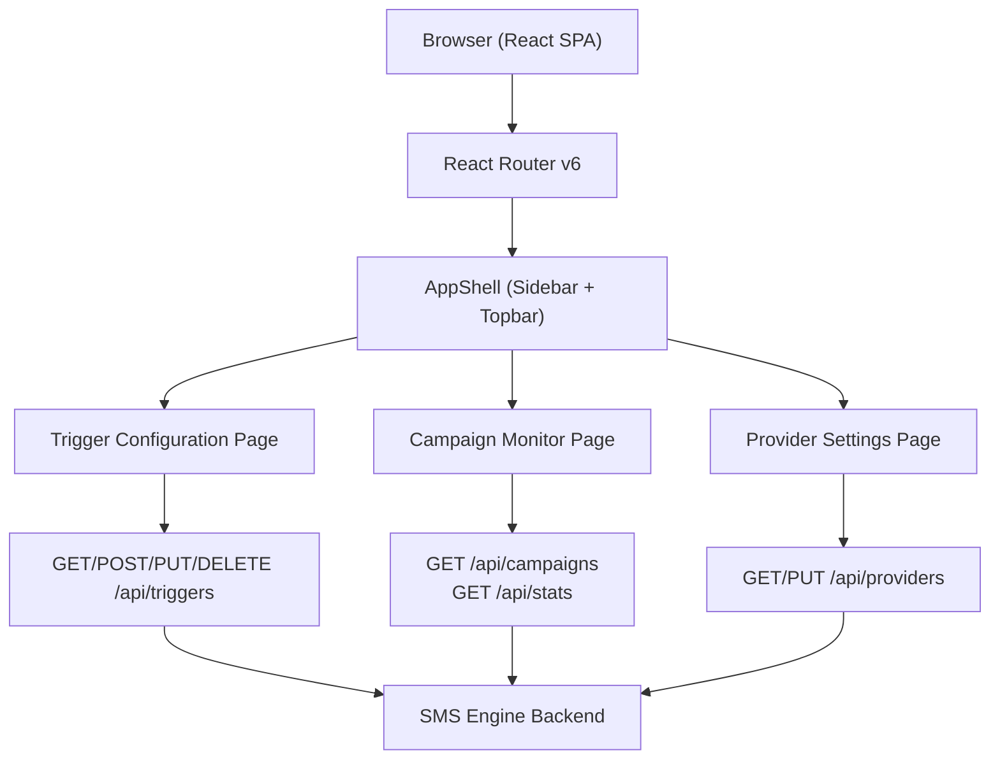

# Design Document: SMS Notification Engine — Admin/Ops Dashboard

## Overview

The Admin/Ops Dashboard is a React single-page application that gives operations and admin teams full control over the SMS Notification Engine — a backend TypeScript library that sends drip-sequence SMS reminders to investors stalled in an onboarding pipeline. The dashboard is divided into three functional areas: **Trigger Configuration** (define funnel steps, delay schedules, message templates, and deep-link patterns), **Campaign Monitor** (observe active campaigns, delivery stats, and failure rates in real time), and **Provider Settings** (swap between Twilio and AWS SNS and manage credentials). The design prioritises a clear navigation structure, actionable data at a glance, and safe editing workflows with confirmation guards.

The application consumes a REST API exposed by the SMS engine backend. All mutations are validated on both client and server; destructive operations (e.g., deleting a trigger or rotating credentials) require explicit confirmation dialogs. The UI is built with React + TypeScript and a component library (shadcn/ui with Tailwind CSS) for consistency and accessibility.

---

## Architecture



---

## Screen Map & Navigation

The application uses a persistent left sidebar for primary navigation. Three top-level routes:

| Route | Label | Icon |
|---|---|---|
| `/triggers` | Trigger Config | Settings icon |
| `/monitor` | Campaign Monitor | Activity icon |
| `/providers` | Provider Settings | Cloud icon |

The sidebar collapses to icon-only on narrow viewports. A breadcrumb bar appears in the topbar for sub-routes (e.g., editing a specific trigger).

---

## Screen 1: Trigger Configuration

### Purpose
Define and manage trigger definitions — each trigger represents a funnel step that, when stalled, initiates a drip-sequence campaign.

### Layout

```
┌──────────────────────────────────────────────────────────────┐
│ Trigger Configuration                         [+ New Trigger] │
├──────────────────────────────────────────────────────────────┤
│ Search: [________________________]  Filter: [All ▾]          │
├──────────────┬───────────────────────────────────────────────┤
│ Trigger List │  Detail / Edit Panel                          │
│              │                                               │
│ ● KYC Start  │  Name: [KYC Incomplete                    ]   │
│   KYC Incomp │  Funnel Step: [kyc_incomplete            ▾]   │
│   Acct Open  │                                               │
│   Acct Pend  │  ── Delay Schedule ──────────────────────     │
│              │  Step 1:  delay [ 24 ] hrs  ○ hrs  ○ days     │
│              │  Step 2:  delay [ 48 ] hrs                    │
│              │  Step 3:  delay [ 72 ] hrs                    │
│              │                          [+ Add Step]         │
│              │                                               │
│              │  ── Message Templates ───────────────────     │
│              │  Step 1: [Hi {name}, complete your KYC…  ]    │
│              │  Step 2: [Reminder: your KYC is waiting…]     │
│              │  Step 3: [Final reminder: {deep_link}    ]    │
│              │                                               │
│              │  ── Deep-Link Pattern ───────────────────     │
│              │  Pattern: [https://app.co/kyc/{investor_id}]  │
│              │                                               │
│              │            [Cancel]  [Save Changes]           │
└──────────────┴───────────────────────────────────────────────┘
```

### Components

#### TriggerListPanel
- Scrollable list of trigger cards
- Each card shows: name, funnel step badge, active/inactive status pill
- Selected card highlighted; click loads detail in right panel
- "New Trigger" button opens blank detail panel

#### TriggerDetailPanel
- **Name field**: free text
- **Funnel Step selector**: dropdown populated from engine's step registry
- **Delay Schedule**: ordered list of steps; each step has a numeric delay input and a unit toggle (hours / days); drag-to-reorder; "Add Step" appends a new row; trash icon removes
- **Message Templates**: one text area per delay step (auto-synced count); supports template variables `{name}`, `{investor_id}`, `{deep_link}`; live character counter (SMS 160-char limit warning)
- **Deep-Link Pattern**: single text input with variable hints tooltip
- **Save / Cancel**: Save validates then calls API; on success shows success toast; on error shows inline field errors

#### DeleteTriggerConfirmDialog
- Triggered by a "Delete" button visible in the detail panel header (danger zone)
- Confirmation text: user must type trigger name to confirm

---

## Screen 2: Campaign Monitor

### Purpose
Give ops teams a live view of all active and recently completed drip campaigns, delivery statistics, and failure details.

### Layout

```
┌────────────────────────────────────────────────────────────────┐
│ Campaign Monitor                    Last refreshed: 12:34:01   │
│                             [Auto-refresh ●]  [Refresh Now]    │
├───────────┬──────────────┬──────────────┬──────────────────────┤
│ Stat Card │  Stat Card   │  Stat Card   │  Stat Card           │
│ Active    │  Sent Today  │  Resolved    │  Failed              │
│  142      │   1,847      │    638       │   23                 │
├───────────┴──────────────┴──────────────┴──────────────────────┤
│                                                                  │
│  ── Delivery Rate Over Time (sparkline / bar chart) ──────────  │
│  [Chart area — 7-day delivery rate by trigger type]             │
│                                                                  │
├──────────────────────────────────────────────────────────────────┤
│ Active Campaigns Table                                           │
│ Search: [_____________]  Filter by trigger: [All ▾]             │
│                                                                  │
│ Investor ID │ Trigger        │ Step │ Next Send     │ Status    │
│ inv_001     │ KYC Incomplete │  2/3 │ in 4h 12m    │ Active ●  │
│ inv_002     │ Account Open   │  1/3 │ in 22h 01m   │ Active ●  │
│ inv_003     │ KYC Incomplete │  3/3 │ Overdue      │ Warning ⚠ │
│ inv_004     │ Account Pend.  │  2/3 │ —            │ Failed ✗  │
│                                      [< Prev]  [1]  [Next >]   │
└──────────────────────────────────────────────────────────────────┘
```

### Components

#### StatCard
- Bold metric value, label underneath, subtle trend indicator (↑↓ vs. previous period)

#### DeliveryRateChart
- Bar or line chart (Recharts) showing delivery success rate per day over the last 7 days
- Colour-coded per trigger type; legend

#### CampaignsTable
- Sortable, paginated (25 rows/page) table of active campaigns
- Columns: Investor ID, Trigger Name, Current Step (n/total), Next Scheduled Send (relative time), Status badge
- Status values: Active (green), Warning (amber — overdue), Failed (red), Resolved (grey)
- Row click opens a CampaignDetailDrawer sliding in from the right
- Filter by trigger name; search by investor ID

#### CampaignDetailDrawer
- Shows full sequence timeline for a single investor campaign
- Timeline: each step shown as a node — sent timestamp, delivery status (delivered/failed/pending), message preview (truncated)
- Failure rows show error code and provider error message

#### AutoRefreshToggle
- Toggle switch; when on, polls `/api/campaigns` and `/api/stats` every 30 seconds
- Shows "Last refreshed" timestamp in topbar area

---

## Screen 3: Provider Settings

### Purpose
Configure which SMS provider is active (Twilio or AWS SNS) and manage provider credentials.

### Layout

```
┌────────────────────────────────────────────────────────────────┐
│ Provider Settings                                              │
├────────────────────────────────────────────────────────────────┤
│                                                                 │
│  Active Provider                                               │
│  ┌──────────────┐   ┌──────────────┐                          │
│  │  ● Twilio    │   │  ○ AWS SNS   │                          │
│  │  (active)    │   │              │                          │
│  └──────────────┘   └──────────────┘                          │
│                                                                 │
│  ── Twilio Credentials ──────────────────────────────────────  │
│  Account SID:   [AC••••••••••••••••••••••••••••••••]  [Edit]  │
│  Auth Token:    [••••••••••••••••••••••••••••••••••]  [Edit]  │
│  From Number:   [+1 555 000 0000                  ]  [Edit]  │
│                                        [Test Connection]      │
│                                                                 │
│  ── AWS SNS Credentials ─────────────────────────────────────  │
│  Access Key ID: [AKIA••••••••••••••••]                [Edit]  │
│  Secret Key:    [••••••••••••••••••••••••••••••••••]  [Edit]  │
│  Region:        [us-east-1                        ]  [Edit]  │
│  Topic ARN:     [arn:aws:sns:us-east-1:…          ]  [Edit]  │
│                                        [Test Connection]      │
│                                                                 │
│  ┌───────────────────────────────────────────────────────────┐ │
│  │ ⚠ Switching the active provider will affect all in-flight │ │
│  │ campaigns. Confirm before saving.                         │ │
│  └───────────────────────────────────────────────────────────┘ │
│                                          [Save Settings]       │
└────────────────────────────────────────────────────────────────┘
```

### Components

#### ProviderSelector
- Two radio-button cards: Twilio and AWS SNS
- Selected card has a highlighted border and "active" badge
- Switching selection shows a warning banner

#### CredentialForm (Twilio)
- Fields: Account SID, Auth Token, From Number
- All sensitive fields rendered as masked inputs (password type)
- Each field has an inline "Edit" button; clicking reveals the field for editing and shows a "Save Field" + "Cancel" pair
- "Test Connection" button sends a dry-run ping to the engine backend; shows success/failure inline

#### CredentialForm (AWS SNS)
- Fields: Access Key ID, Secret Access Key, Region (dropdown of AWS regions), Topic ARN
- Same masked + inline-edit pattern as Twilio

#### ProviderSwitchConfirmDialog
- Triggered when active provider changes and user clicks "Save Settings"
- Warns about in-flight campaigns; requires explicit "Yes, switch provider" confirmation

---

## Data Models

### TriggerDefinition

```typescript
interface TriggerDefinition {
  id: string                   // UUID
  name: string                 // Display name
  funnelStep: string           // Engine step key, e.g. "kyc_incomplete"
  isActive: boolean
  schedule: DelayStep[]        // Ordered list of delay steps
  deepLinkPattern: string      // URL template with {investor_id}
  createdAt: string            // ISO 8601
  updatedAt: string
}

interface DelayStep {
  order: number                // 1-based index
  delayAmount: number
  delayUnit: 'hours' | 'days'
  messageTemplate: string      // May contain {name}, {investor_id}, {deep_link}
}
```

### Campaign

```typescript
interface Campaign {
  id: string
  investorId: string
  triggerId: string
  triggerName: string
  currentStep: number          // 1-based
  totalSteps: number
  nextScheduledAt: string | null  // ISO 8601; null if resolved/failed
  status: 'active' | 'resolved' | 'failed' | 'warning'
  steps: CampaignStep[]
}

interface CampaignStep {
  order: number
  scheduledAt: string
  sentAt: string | null
  deliveryStatus: 'pending' | 'sent' | 'delivered' | 'failed'
  errorCode: string | null
  errorMessage: string | null
  messagePreview: string
}
```

### Stats

```typescript
interface DashboardStats {
  activeCampaigns: number
  sentToday: number
  resolvedToday: number
  failedToday: number
  deliveryRateHistory: DailyDeliveryRate[]
}

interface DailyDeliveryRate {
  date: string           // YYYY-MM-DD
  deliveryRate: number   // 0–1
  triggerId: string
  triggerName: string
}
```

### Provider Configuration

```typescript
type ProviderType = 'twilio' | 'aws_sns'

interface ProviderConfig {
  activeProvider: ProviderType
  twilio: TwilioCredentials
  awsSns: AwsSnsCredentials
}

interface TwilioCredentials {
  accountSid: string       // Masked in responses; send full value only on write
  authToken: string        // Masked
  fromNumber: string
}

interface AwsSnsCredentials {
  accessKeyId: string      // Masked
  secretAccessKey: string  // Masked
  region: string
  topicArn: string
}
```

---

## API Contract (Frontend Perspective)

| Method | Endpoint | Purpose |
|---|---|---|
| GET | `/api/triggers` | List all trigger definitions |
| POST | `/api/triggers` | Create new trigger |
| PUT | `/api/triggers/:id` | Update trigger |
| DELETE | `/api/triggers/:id` | Delete trigger |
| GET | `/api/campaigns` | List campaigns (paginated, filterable) |
| GET | `/api/stats` | Fetch dashboard stats and delivery history |
| GET | `/api/providers` | Get current provider config (credentials masked) |
| PUT | `/api/providers` | Update provider config |
| POST | `/api/providers/test` | Test active provider connection |

---

## Error Handling

### Network / API Errors

- **4xx client errors**: Display inline field-level errors (validation messages from API response body)
- **5xx server errors**: Display a dismissible banner at the top of the page: "Something went wrong. Try again or contact support."
- **Network timeout / offline**: Show a non-blocking toast: "Connection lost. Retrying…" with auto-retry using exponential backoff (max 3 retries)

### Form Validation (Client-Side)

- Trigger name: required, max 100 chars
- Funnel step: required, must match a known step key
- Delay amount: positive integer, max 365 days equivalent
- Message template: required per step, max 160 chars per SMS segment (warn at 160, block at 480 / 3 segments)
- Deep-link pattern: must be a valid URL template containing `{investor_id}`
- Credentials: all fields required; Account SID and Auth Token validated with regex patterns

### Confirmation Guards

- Navigating away from an unsaved trigger edit shows a browser-native "Leave site?" or a custom modal
- Deleting a trigger shows a type-to-confirm dialog
- Switching provider shows a consequence warning dialog

---

## Testing Strategy

### Unit Testing Approach

Test individual components and utility functions in isolation using React Testing Library + Vitest:
- TriggerDetailPanel: validates form field rendering, validation error display, save/cancel behaviour
- DelaySchedule: validates add/remove step, reordering, unit toggle
- StatCard: renders correct values and trend indicators
- CampaignsTable: sorting, pagination, row click
- ProviderSelector: switching selection, warning banner display
- CredentialForm: masking, inline edit mode, field-level save

### Property-Based Testing Approach

**Property Test Library**: fast-check

Property tests cover data transformation and validation utilities:
- SMS character count and segment calculation (for any string, segment count is deterministic and ≥ 1)
- Deep-link pattern interpolation (for any valid investor ID, interpolated URL is always a valid URL)
- Delay schedule ordering invariant (after any add/remove/reorder operation, step `order` values are contiguous and 1-based)
- Campaign status derivation (for any campaign data shape, a status is always assigned — no undefined)

### Integration Testing Approach

Integration tests use MSW (Mock Service Worker) to intercept API calls and test full page flows:
- Create a trigger: fill form → save → list updates
- Delete a trigger: click delete → type-to-confirm → trigger removed from list
- Monitor auto-refresh: advance timers → stats and table re-fetched
- Provider switch: select new provider → confirm dialog → PUT call made

---

## Performance Considerations

- Campaign monitor table is paginated (25 rows/page); the backend handles pagination — no client-side data accumulation
- Auto-refresh uses a debounced polling interval (30 s); the interval is cleared when the tab is hidden (`visibilitychange` event) to avoid unnecessary background requests
- Delivery rate chart data is fetched once on mount and re-fetched on manual refresh; it is not included in the auto-refresh cycle to reduce payload
- Trigger list is small (expected < 50 triggers); it is loaded once and updated optimistically on save/delete

---

## Security Considerations

- Credentials are **never stored in React state beyond the active editing session**; the component clears credential values on unmount
- Masked credential display: the frontend never receives the actual secret values — the API returns `"••••••••"` placeholder strings; actual secrets are only transmitted on write operations
- The "Test Connection" endpoint accepts no credential payload — it uses credentials already stored server-side, preventing credential exposure through the test endpoint
- All API requests include an `Authorization: Bearer <token>` header (token managed by the auth context); the dashboard assumes an authenticated session — unauthenticated users are redirected to a login screen outside the scope of this feature
- CSRF protection is expected to be handled at the API gateway layer

---

## Dependencies

| Package | Purpose |
|---|---|
| `react` + `react-dom` | UI framework |
| `react-router-dom` v6 | Client-side routing |
| `typescript` | Type safety |
| `tailwindcss` | Utility-first styling |
| `shadcn/ui` | Accessible component primitives (Dialog, Toast, Badge, etc.) |
| `recharts` | Delivery rate chart |
| `react-hook-form` | Form state and validation |
| `zod` | Schema validation (shared with API contract types) |
| `@tanstack/react-query` | Data fetching, caching, auto-refresh |
| `msw` | API mocking for tests |
| `vitest` + `@testing-library/react` | Unit and integration tests |
| `fast-check` | Property-based testing |

---

## Correctness Properties

*A property is a characteristic or behavior that should hold true across all valid executions of a system — essentially, a formal statement about what the system should do. Properties serve as the bridge between human-readable specifications and machine-verifiable correctness guarantees.*

---

### Property 1: Trigger card renders required fields

*For any* `TriggerDefinition` object, rendering it as a list card should produce a card element that contains the trigger name, the funnel step badge, and the active/inactive status pill.

**Validates: Requirements 2.2**

---

### Property 2: Search filter correctness

*For any* list of `TriggerDefinition` objects and any non-empty search string, after the search filter is applied every displayed card's `name` must contain the search string (case-insensitively), and no card whose name does not contain the search string may appear.

**Validates: Requirements 2.3**

---

### Property 3: Funnel-step filter correctness

*For any* list of `TriggerDefinition` objects and any selected funnel step value, after the filter is applied every displayed card must have a `funnelStep` equal to the selected value, and no card with a different `funnelStep` may appear.

**Validates: Requirements 2.4**

---

### Property 4: Detail panel field population

*For any* `TriggerDefinition` loaded into the `TriggerDetailPanel`, every rendered form field value (name, funnel step, each delay step's amount and unit, each message template, and the deep-link pattern) must equal the corresponding field on the loaded trigger.

**Validates: Requirements 4.1**

---

### Property 5: Delay schedule order invariant

*For any* `DelayStep[]` and any sequence of add, remove, or reorder mutations applied to it, the resulting array must always have `order` values that are contiguous integers starting at 1 (i.e., `[1, 2, …, n]` with no gaps or duplicates).

**Validates: Requirements 5.3, 5.4**

---

### Property 6: Template count tracks step count

*For any* `DelayStep[]`, the number of visible message template text areas rendered in the `TriggerDetailPanel` must always equal the length of the `DelayStep` array, regardless of how many add or remove operations have been performed.

**Validates: Requirements 5.5, 6.1**

---

### Property 7: Non-positive delay amount fails validation

*For any* delay amount value that is zero or a negative integer, the client-side validation function must return a non-empty error string for that field and must not allow the form to be submitted.

**Validates: Requirements 5.6**

---

### Property 8: Over-limit delay amount fails validation

*For any* delay amount and unit combination whose equivalent duration exceeds 365 days, the client-side validation function must return a non-empty error string and must not allow the form to be submitted.

**Validates: Requirements 5.7**

---

### Property 9: Empty message template fails validation

*For any* `DelayStep[]` where at least one `messageTemplate` field is the empty string (or contains only whitespace), the form validation must return an error for that specific step's template field, and form submission must be prevented.

**Validates: Requirements 6.2**

---

### Property 10: Over-480-character message template fails validation

*For any* string whose character count exceeds 480, the message template validator must return a blocking error: the string fails validation and form submission is prevented.

**Validates: Requirements 6.4**

---

### Property 11: Template variables are not flagged as errors

*For any* message template string that contains only the tokens `{name}`, `{investor_id}`, and `{deep_link}` as variable references (in any combination and repetition), the validator must not produce a validation error attributable to the presence of those tokens.

**Validates: Requirements 6.5**

---

### Property 12: Deep-link validation

*For any* string that either (a) does not contain the literal substring `{investor_id}` or (b) is not a valid URL when all `{…}` placeholder tokens are replaced with legal URL-segment values, the deep-link pattern validator must return a non-empty error string and prevent form submission.

**Validates: Requirements 7.3, 7.4**

---

### Property 13: Type-to-confirm delete guard

*For any* trigger with name `N`, the confirm button in the `DeleteTriggerConfirmDialog` must remain disabled for every input string that is not strictly equal to `N`, and must be enabled only when the input string equals `N` exactly.

**Validates: Requirements 8.3, 19.4**

---

### Property 14: Stat card data accuracy

*For any* `DashboardStats` object, each of the four `StatCard` components must display the exact numeric value from its corresponding field (`activeCampaigns`, `sentToday`, `resolvedToday`, `failedToday`), and the trend indicator direction must be ↑ when the current value is greater than the previous period value and ↓ when it is less.

**Validates: Requirements 9.2, 9.3**

---

### Property 15: Campaign table column completeness

*For any* `Campaign` object rendered as a row in the `CampaignsTable`, the row must contain cells for: Investor ID, Trigger Name, current step formatted as `currentStep/totalSteps`, Next Scheduled Send as a relative time string, and a Status badge.

**Validates: Requirements 11.2**

---

### Property 16: Status badge colour mapping

*For any* campaign `status` value (`active` | `warning` | `failed` | `resolved`), the rendered Status badge must apply the colour defined in the spec (green / amber / red / grey respectively). No status value may produce an uncoloured or incorrectly coloured badge.

**Validates: Requirements 11.3**

---

### Property 17: Pagination row limit

*For any* list of `N` campaigns where `N > 25`, the `CampaignsTable` must render exactly 25 rows on page 1, and the remaining `N − 25` rows must not be visible until the user navigates to subsequent pages.

**Validates: Requirements 11.4**

---

### Property 18: Campaign search filter correctness

*For any* list of `Campaign` objects and any non-empty search string, after the investor-ID search is applied every visible row's `investorId` must contain the search string, and no row whose `investorId` does not contain the search string may appear.

**Validates: Requirements 11.6**

---

### Property 19: Campaign trigger filter correctness

*For any* list of `Campaign` objects and any selected trigger value, every visible row must have a `triggerName` equal to the selected trigger, and no row with a different trigger may appear.

**Validates: Requirements 11.7**

---

### Property 20: Campaign detail drawer step ordering

*For any* `Campaign` whose `steps` array is provided in arbitrary order, the `CampaignDetailDrawer` must render the steps sorted strictly ascending by the `order` field, with no steps omitted.

**Validates: Requirements 12.2**

---

### Property 21: Campaign detail drawer step fields

*For any* `CampaignStep`, the corresponding timeline node in the `CampaignDetailDrawer` must contain the scheduled timestamp, the delivery status label, and a non-empty message preview. When `deliveryStatus` is `failed`, the node must additionally display the `errorCode` and `errorMessage` fields.

**Validates: Requirements 12.3, 12.4**

---

### Property 22: Last-refreshed timestamp accuracy

*For any* successful completion of a fetch cycle on the Campaign Monitor page, the "Last refreshed" timestamp displayed in the topbar must equal the wall-clock time recorded immediately after the fetch promise resolves.

**Validates: Requirements 13.6**

---

### Property 23: Trigger name length validation

*For any* string whose character count exceeds 100, the trigger name validator must return a non-empty error string and prevent form submission.

**Validates: Requirements 17.2**

---

### Property 24: Twilio Account SID format validation

*For any* string that does not start with the two characters `AC` or whose total length is not exactly 34 characters, the Account SID validator must return a non-empty error string.

**Validates: Requirements 17.4**

---

### Property 25: Twilio Auth Token format validation

*For any* string that is not exactly 32 hexadecimal characters (`[0-9a-fA-F]{32}`), the Auth Token validator must return a non-empty error string.

**Validates: Requirements 17.5**

---

### Property 26: Validation errors rendered inline

*For any* form submission that produces one or more validation errors, every error message must be rendered in the DOM as a sibling or direct descendant of the input element it describes, and no error may appear only in a separate top-level error summary component.

**Validates: Requirements 17.6**

---

### Property 27: Authorization header on every request

*For any* API call made by the Dashboard while the `Auth_Context` contains a Bearer token `T`, the outgoing HTTP request must include the header `Authorization: Bearer T`. No API request may be dispatched without this header when a valid token is present.

**Validates: Requirements 20.1**
